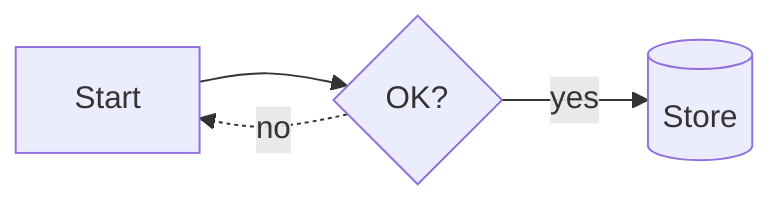

# Diagrams

Architecture diagrams, flowcharts, and state machines as a node/edge list, with layout computed automatically -- no coordinates to place by hand:

```python
doc.diagram(
    nodes=[
        {"id": "api", "label": "API Gateway"},
        {"id": "auth", "label": "Auth Service"},
        {"id": "db", "label": "User Store", "shape": "store"},
        {"id": "ok", "label": "Response", "shape": "rounded"},
    ],
    edges=[
        {"src": "api", "dst": "auth", "label": "verify"},
        {"src": "auth", "dst": "db"},
        {"src": "db", "dst": "auth", "style": "dashed"},
        {"src": "auth", "dst": "ok"},
    ],
    caption="Login flow",
)
```

In the JSON spec this is `{"type": "diagram", "nodes": [...], "edges": [...], "direction": "down", "caption": "..."}`.

## Nodes and edges

```python
from emboss import DiagramNode, DiagramEdge

DiagramNode(id="api", label="API Gateway", shape="box", group=None)
DiagramEdge(src="api", dst="auth", label="verify", style="solid")
```

Both also accept loose input: a `dict` with the matching keys, or a positional tuple (`(id, label)`, `(id, label, shape)` for nodes; `(src, dst)`, `(src, dst, label)`, `(src, dst, label, style)` for edges).

| Node `shape` | Renders as |
|--------------|------------|
| `box` (default) | Rounded-corner rectangle |
| `rounded` | Pill-cornered rectangle |
| `decision` | Diamond |
| `store` | Database cylinder |
| `start_end` | Full pill (stadium shape) |

Edge `style` is `solid` (default) or `dashed`, for marking optional or asynchronous paths. `direction` is `down` (top-to-bottom layers, the default) or `right` (left-to-right).

## Swimlanes

Give every node a `lane` and pass `lanes` (the ordered lane names) to `doc.diagram(...)` for a swimlane workflow diagram -- one banded column per lane for `direction="down"`, one banded row for `direction="right"`. The normal layered layout still orders nodes along the flow axis; lanes only constrain the cross axis.

```python
doc.diagram(
    nodes=[
        {"id": "req", "label": "Request", "lane": "Client"},
        {"id": "auth", "label": "Authenticate", "lane": "Backend"},
        {"id": "db", "label": "Query DB", "lane": "Backend"},
        {"id": "resp", "label": "Response", "lane": "Client"},
    ],
    edges=[("req", "auth"), ("auth", "db"), ("db", "resp")],
    lanes=["Client", "Backend"],
    caption="Login sequence",
)
```

Leaving `lanes` unset while nodes carry a `lane` infers the lane order from each node's first appearance, so the order is still deterministic without spelling it out. Every node must have a valid `lane` once lanes are active -- an unassigned or unknown lane name raises `ValueError` naming the offending node.

## Force-directed layout

`doc.diagram(nodes, edges, layout="force")` swaps the default layered flow for a spring-embedder layout, for graphs with no natural hierarchy -- a mesh or peer-to-peer network topology where there's no clear "start" and no meaningful flow direction.

```python
doc.diagram(
    nodes=[{"id": "a", "label": "Node A"}, {"id": "b", "label": "Node B"}, {"id": "c", "label": "Node C"}],
    edges=[("a", "b"), ("b", "c"), ("c", "a")],
    layout="force",
    caption="Peer mesh",
)
```

Deterministic by construction, not by convention: initial node positions are seeded evenly around a circle in input order (no `random()`), and a fixed iteration count with a fixed linear cooling schedule always converges to the same layout for the same input -- the same guarantee every other diagram type makes, just harder to get right for a physics-based algorithm. Edges render as straight lines rather than the layered layout's orthogonal routing, since there's no flow axis to route along. `layout="force"` is not combinable with `lanes` (a swimlane needs a flow axis); passing both raises `ValueError`.

## Layout algorithm

`layout_diagram(nodes, edges, direction="down")` (in `emboss.diagrams`) computes the placement in three passes:

1. **Layering.** A longest-path layering assigns each node to a layer based on its edges, after detecting and reversing back edges (a DFS over the graph) so cyclic graphs still get a sensible layered layout -- the reversed edges are only used for layout; rendering draws each edge along its real, authored direction, including self-loops as a small loop back into the node.
2. **Ordering.** Within each layer, nodes are ordered by four barycenter sweeps (two downward passes weighted by predecessor position, two upward weighted by successor position) to reduce edge crossings.
3. **Placement.** Node sizes come from real font metrics (label text wrapped to a maximum node width), and layers are spaced with even gaps between siblings and between layers.

```python
from emboss import layout_diagram

layout = layout_diagram(nodes, edges, direction="down")
layout.width, layout.height   # canvas size
layout.by_id["api"].x, layout.by_id["api"].y   # a PlacedNode's resolved box
```

## Rendering and accessibility

`render_diagram_svg(nodes, edges, direction=, lanes=, layout=, theme_colors=)` emits deterministic SVG markup (shapes, routed edge paths with arrowheads, and centered multi-line labels), which is what `doc.diagram(...)` renders through the SVG embedding path -- diagrams are native vector graphics, not rasterized images.

```python
from emboss import diagram_alt_text

diagram_alt_text(nodes, edges)
# "Diagram: 4 nodes (API Gateway, Auth Service, User Store, Response), 4 connections"
```

`diagram_alt_text` builds a deterministic accessibility summary (node count, first few labels, connection count), and `doc.diagram(...)` / `diagram_svg_block(...)` set it as the block's `/Alt` text automatically unless a caller overrides it -- no diagram ships without alt text.

## Markdown syntax

A fenced ` ```diagram ` block accepts a minimal line-oriented syntax, so an LLM (or a person) can write a diagram without JSON:

````
```diagram
direction: right
api: API Gateway
auth: Auth Service
db: User Store [store]
ok: Response [rounded]
api -> auth: verify
auth -> db
db --> auth
auth -> ok
```
````

- `id: Label [shape]` declares a node (`[shape]` is optional, defaults to `box`).
- `a -> b: label` declares a solid edge; `-->` declares a dashed one. The label is optional.
- `direction: right` (or `down`) sets the flow axis; it may appear anywhere and applies to the whole diagram.
- Blank lines and `#`-prefixed comments are ignored. An id referenced only by an edge becomes an implicit box node with its id as the label.
- A malformed line raises `ValueError` quoting the offending line, so an LLM generating this syntax gets a correctable error rather than a silently wrong diagram.

`emboss.diagrams.parse_diagram_source(text)` parses this syntax into `(nodes, edges, direction)`; `diagram_block_from_source(text, caption=None)` does the same and returns the rendered block directly, which is what the Markdown parser calls for a ` ```diagram ` fence.

## Specialized diagram types

The general flowchart above lays out any node/edge graph. Six purpose-built types cover the diagrams a technical design or transformation document needs most. Each takes a plain description, lays itself out automatically, rides the same native-vector SVG path, and sets deterministic `/Alt` text. All six are exposed in the fluent API, the JSON spec, the Pydantic schema, and the LLM spec prompt.

### Cloud and deployment architecture

`doc.architecture_diagram(nodes, edges, groups=..., direction="down")`. Each node names a built-in `service` glyph and an optional `group`; groups nest to draw zones (a VPC wrapping public and private subnets, for instance). The twelve glyphs are `compute`, `database`, `storage`, `queue`, `gateway`, `cache`, `cdn`, `function`, `loadbalancer`, `user`, `external`, and `generic` -- each a self-authored vector shape, so the same diagram relabels cleanly to an AWS, Azure, or GCP topology.

```python
doc.architecture_diagram(
    nodes=[
        {"id": "alb", "label": "ALB", "service": "loadbalancer", "group": "public"},
        {"id": "ec2", "label": "EC2 - App", "service": "compute", "group": "private"},
        {"id": "rds", "label": "RDS", "service": "database", "group": "private"},
    ],
    edges=[("alb", "ec2"), ("ec2", "rds", "SQL")],
    groups=[
        {"id": "public", "label": "Public Subnet", "node_ids": ["alb"]},
        {"id": "private", "label": "Private Subnet", "node_ids": ["ec2", "rds"]},
        {"id": "vpc", "label": "VPC", "node_ids": ["public", "private"]},
    ],
    caption="AWS three-tier architecture",
)
```

A group's `node_ids` may list other group ids, which is how zones nest. Edges are solid or `dashed` with optional labels; an `image` field is accepted on a node but falls back to the built-in glyph, since the SVG subset does not embed raster images. Zone titles render on a solid chip above the edges, so a title never collides with an edge label crossing the zone boundary.

#### Status-colored landscape / capability maps

Giving a node an optional `status` turns the same diagram into a status-colored application-landscape map: a small colored badge is drawn on the node, and a legend row listing every status actually in use is appended automatically -- in a fixed order, independent of node input order, so the same statuses always produce the same legend.

```python
doc.architecture_diagram(
    nodes=[
        {"id": "crm", "label": "CRM", "service": "generic", "status": "ok"},
        {"id": "billing", "label": "Billing", "service": "generic", "status": "warning"},
        {"id": "legacy", "label": "Legacy ERP", "service": "generic", "status": "retired"},
    ],
    edges=[("crm", "billing")],
    caption="Application landscape",
)
```

The five statuses are `ok` (green), `warning` (amber), `critical` (red), `planned` (blue), and `retired` (gray). A node with no `status` set draws no badge and is left out of the legend.

### Sequence

`doc.sequence_diagram(participants, messages)`. One dashed lifeline is drawn per participant. Each message has a `style`: `sync` (solid line, filled arrowhead), `async` (solid line, open arrowhead), or `return` (dashed). Setting `activate=True` opens an activation bar on the receiving lifeline that closes at its matching `return`; a message whose `from` and `to` are the same participant renders as a self-loop.

```python
doc.sequence_diagram(
    participants=[{"id": "u", "label": "Client"}, {"id": "api", "label": "API"}],
    messages=[
        {"from": "u", "to": "api", "label": "POST /settle", "style": "sync",
         "activate": True},
        {"from": "api", "to": "u", "label": "202 Accepted", "style": "return"},
    ],
)
```

### Entity-relationship

`doc.er_diagram(entities, relationships)`. Each entity draws as a titled table of attributes; an attribute's `key` of `PK` or `FK` is shown in its own column, and an optional `type` in another. Each relationship draws a connector labeled with its name and `from_card`/`to_card` cardinality (`1`, `N`, `0..1`, and so on).

```python
doc.er_diagram(
    entities=[
        {"id": "account", "name": "Account", "attributes": [
            {"name": "id", "key": "PK", "type": "uuid"},
            {"name": "balance", "type": "money"},
        ]},
        {"id": "payment", "name": "Payment", "attributes": [
            {"name": "id", "key": "PK", "type": "uuid"},
            {"name": "account_id", "key": "FK", "type": "uuid"},
        ]},
    ],
    relationships=[
        {"from": "account", "to": "payment", "label": "makes",
         "from_card": "1", "to_card": "N"},
    ],
)
```

### Roadmap / timeline

`doc.roadmap(periods, workstreams, milestones=None, caption=...)`. `periods` is an ordered list of labels (quarters, phases, sprints -- no date arithmetic, so a bare label list is enough); each workstream is a named row of status-colored bars spanning an inclusive period range, and milestones draw as diamond markers either on a specific workstream's row or, when `workstream` is omitted, on a shared strip above all rows. Bars and milestones share the same five-status palette as [architecture-diagram status coloring](#status-colored-landscape--capability-maps) (`ok`, `warning`, `critical`, `planned`, `retired`), and a legend is auto-generated whenever any status is used.

```python
doc.roadmap(
    periods=["Q1", "Q2", "Q3", "Q4"],
    workstreams=[
        {"name": "Platform", "bars": [
            {"label": "Migration", "start": "Q1", "end": "Q2", "status": "ok"},
        ]},
        {"name": "Data", "bars": [
            {"label": "Warehouse", "start": "Q2", "end": "Q4", "status": "planned"},
        ]},
    ],
    milestones=[{"label": "Launch", "at": "Q3"}],
    caption="FY26 roadmap",
)
```

A bar's `start`/`end` and a milestone's `at` must reference a declared period; an unknown period, an end before its start, duplicate periods, or a milestone pinned to an unknown workstream all raise a clear `ValueError` naming the offender.

### Org chart

`doc.org_chart(nodes, edges, direction="down")`. Nodes and edges are the same `DiagramNode`/`DiagramEdge` shapes as the general flowchart, but the layout is different: every node may have at most one incoming edge (`src` is the manager, `dst` the report), and each parent is centered over the full width its children occupy rather than ordered by crossing-minimization.

```python
doc.org_chart(
    nodes=[
        {"id": "ceo", "label": "CEO"},
        {"id": "cto", "label": "CTO"},
        {"id": "cfo", "label": "CFO"},
        {"id": "eng", "label": "Eng Lead"},
    ],
    edges=[
        {"src": "ceo", "dst": "cto"},
        {"src": "ceo", "dst": "cfo"},
        {"src": "cto", "dst": "eng"},
    ],
    caption="Leadership",
)
```

A node named as the destination of two edges (two managers for one report) or a cycle both raise a clear `ValueError`. Multiple roots (a forest of separate trees) are allowed and laid out side by side. `direction="right"` grows the tree left-to-right instead of top-to-bottom.

### Gantt chart

`doc.gantt(tasks, milestones=None, caption=...)`. Where a roadmap uses period labels, a Gantt chart uses real `start`/`end` calendar dates (`YYYY-MM-DD`) on a continuous axis -- bar position and width are computed proportionally against the full date range spanned by all tasks and milestones. Each task is a row: an optional `progress` (`0.0`-`1.0`) draws a darker fill from the left edge, `status` colors the bar from the same five-status palette as architecture diagrams and roadmaps, and `dependencies` (other task names) draw arrows from the dependency's end to the dependent's start.

```python
doc.gantt(
    tasks=[
        {"name": "Design", "start": "2026-01-01", "end": "2026-01-15",
         "progress": 1.0, "status": "ok"},
        {"name": "Build", "start": "2026-01-10", "end": "2026-02-15",
         "progress": 0.4, "status": "planned", "dependencies": ["Design"]},
    ],
    milestones=[{"label": "Kickoff", "at": "2026-01-01"}],
    caption="Q1 project plan",
)
```

An unparseable date, an end before its start, a duplicate task name, or a dependency naming an unknown task all raise a clear `ValueError`. Task names must be unique since dependencies reference them by name.

Each type accepts loose `dict`/tuple input or its dataclass form (`ArchNode`/`ArchGroup`, `SequenceParticipant`/`SequenceMessage`, `Entity`/`EntityAttribute`/`Relationship`, `RoadmapWorkstream`/`RoadmapBar`/`RoadmapMilestone`, `GanttTask`/`GanttMilestone`), and raises a clear `ValueError` naming the offending id when an edge, message, relationship, or group member points at a node that does not exist.

## Mermaid

A large amount of existing technical documentation already contains diagrams written as [Mermaid](https://mermaid.js.org) source. Rather than asking every document to be rewritten, a ` ```mermaid ` fence (or `parse_mermaid(source)` directly) parses that source onto the diagram builders above, so it renders as native vector graphics, the same way as an Emboss-authored diagram.

````markdown

````

```python
from emboss import parse_mermaid

block = parse_mermaid(source)   # an SvgBlock; doc.add(block) to place it
```

### Supported syntax

**`flowchart` / `graph`** (maps to `diagram_svg_block`): direction `TD`/`TB`/`BT` (down) or `LR`/`RL` (right); node shapes `A[Label]` (box), `A(Label)` (rounded), `A{Label}` (decision), `A[(Label)]` (store), `A([Label])` (start_end); edges `A --> B`, `A -->|label| B` (labeled), `A -.-> B` (dashed), and chains (`A --> B --> C`).

**`sequenceDiagram`** (maps to `sequence_svg_block`): `participant X as Label` (or `actor`); messages `A->>B: msg` (sync), `A-->>B: msg` (return, dashed), `A-)B: msg` (async); `+`/`-` or `activate`/`deactivate` for an activation bar.

**`erDiagram`** (maps to `er_svg_block`): entities with an attribute block (`USER { int id PK string email }`) and relationships (`USER ||--o{ ORDER : places`), with cardinality tokens mapped to the same `from_card`/`to_card` values `er_diagram` uses.

### Errors and degraded parsing

An unsupported kind (`classDiagram`, `stateDiagram`, or anything else) raises `MermaidError` naming the kind, rather than guessing at a rendering. Inside Markdown, a ` ```mermaid ` block that fails to parse degrades to a code block showing the raw source and reports the failure through `parse_markdown`'s `on_warning` callback; pass `strict=True` to `parse_markdown` to raise instead of degrading. Styling-only lines (`classDef`, `style`, `click`), `subgraph` containment, and sequence `Note`/`loop`/`alt` grouping are recognized and skipped rather than mis-rendered.

`parse_flowchart`, `parse_sequence`, and `parse_er` are the per-kind entry points `parse_mermaid` dispatches to, if the kind is already known.
